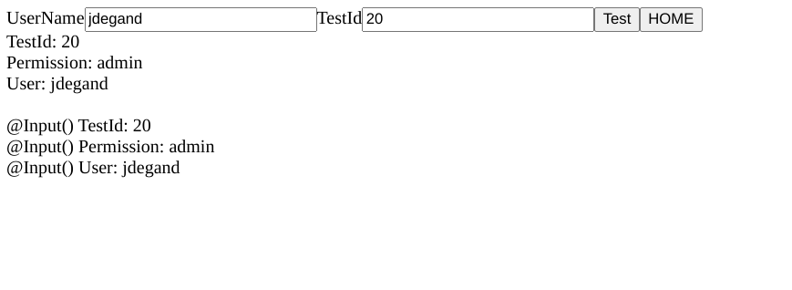

# RouterInput

[Thomas Laforge's Angular Challenges](https://github.com/tomalaforge/angular-challenges) (#22) router-input solution.    

## Screenshots

## Built With

- [Angular CLI](https://github.com/angular/angular-cli) version 16.2.0.
- [Angular](https://angular.io)

## Thoughts

- Started with my own angular project -> angular challenges repo requires too much space and I don't plan on submitting a pull request -> Thomas Laforge only reviews a few pull-requests a month and there are already 75+ pull requests
- I left the activatedRoute code.
- Used transform to make the testId a number instead of a string.
- I think the transform property makes the @Input strategy more useful than activatedRoute.
- Also, you don't have to differentiate between params / queryParams with @Input().  
- I renamed permission to have a different name - you pass the name defined in the route to @Input() and then you can change the variable to something else.   

## Directions

In this small application, you can pass data though routing to `TestComponent`. v16 of Angular introduced `RouterInput`. The goal of this exercice is to refactor the code to use the new `RouterInput` strategy.

## Useful Resources

- [FreeCodeCamp](https://www.freecodecamp.org/news/use-input-for-angular-route-parameters/) - use input for angular route parameters
